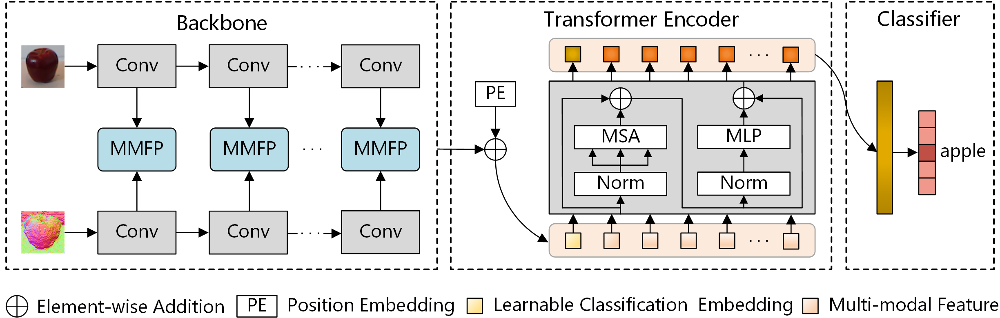

# Cross-Level Multi-Modal Feature Learning with Transformer for RGB-D Object Recognition
**CNN-TransNet** is an innovative end-to-end Transformer-based architecture integrated with convolutional neural networks (CNNs), designed specifically for RGB-D object recognition. Our approach has demonstrated state-of-the-art accuracy on three major datasets: Washington RGB-D Object Dataset (95.4%), JHUIT-50 (98.1%), and Object Clutter Indoor Dataset (94.7%), showcasing its effectiveness and superiority in the RGB-D object recognition domain.

## Table of Contents
- [Installation](#installation)
- [Usage](#usage)
- [Citations](#citations)
## Installation
To install and run this project using a Conda environment, follow these steps:
1. **Clone the Repository**
   ```bash
   git clone https://github.com/Yinmlmaoliang/CNN-TransNet.git
   cd CNN-TransNet
   ```
2. **Create and Activate a Conda Environment**
   ```bash
   conda create --name myenv python=3.7  # Replace 'myenv' with your preferred env name
   conda activate myenv
   ```
3. **Install Dependencies**
   ```bash
   pip install -r requirements.txt
   ```
## Usage
This section outlines the recommended file structure and basic usage instructions for the project.
### Recommended File Structure
```plaintext
CNN-TransNet/
│
├── data/                  
│   ├── examples/          
│   ├── splits/           
│   ├── rgbd-dataset/      # Dataset directory
│   └── weights/           # Trained model weights
├── img/                 
├── nets/                  # Moel configurations
│   ├── model.py           
│   └── ...           
├── utils/
│   ├── train_one_epoch.py           
│   └── ...
├── demo.ipynb
├── train.py              # Main script to train the model
├── requirements.txt      # Dependency file
└── README.md             # Project README
```
### Application to One Input
We have provided a `demo.ipynb` Jupyter notebook to easily run predictions using our pretrained model.
- Download the pretrained model weights from this link: [Pretrained Model Weights](<https://drive.google.com/drive/folders/19WQEEbjY8TDvwIt18bUyYPIO2Rngrglb?usp=drive_link>).
- Place the downloaded weights in the `data/weights/` directory.
- Example input images are provided in the `data/examples/` directory.
### Training the Model on Washington RGB-D Object Dataset
#### Data Preparation
Washington RGB-D Object dataset is available [here](<https://rgbd-dataset.cs.washington.edu/dataset.html>).The `train.py` script utilizes a specific depth image processing method as detailed in the [paper](https://www.sciencedirect.com/science/article/abs/pii/S1077314222000133). This method is crucial for preparing the dataset for effective training of our model. The following directory structure is a reference to run the `train.py` script.
```plaintext
rgbd-dataset/
│
├── apple/                  
│   ├── apple_1/
│   │   ├── apple_1_1_1_crop.png
│   │   ├── apple_1_1_1_depthcrop.hdf5
│   │   ├── apple_1_1_1_depthcrop.png
│   │   ├── apple_1_1_1_loc.txt
│   │   └── ...           
│   └── ...
```
### Running the Training Script
```bash
python train.py
```
## Citations
If you find this work useful in your research, please consider citing:
```plaintext
@ARTICLE{10124000,
  author={Zhang, Ying and Yin, Maoliang and Wang, Heyong and Hua, Changchun},
  journal={IEEE Transactions on Circuits and Systems for Video Technology}, 
  title={Cross-Level Multi-Modal Features Learning With Transformer for RGB-D Object Recognition}, 
  year={2023},
  volume={33},
  number={12},
  pages={7121-7130},
  doi={10.1109/TCSVT.2023.3275814}}
```